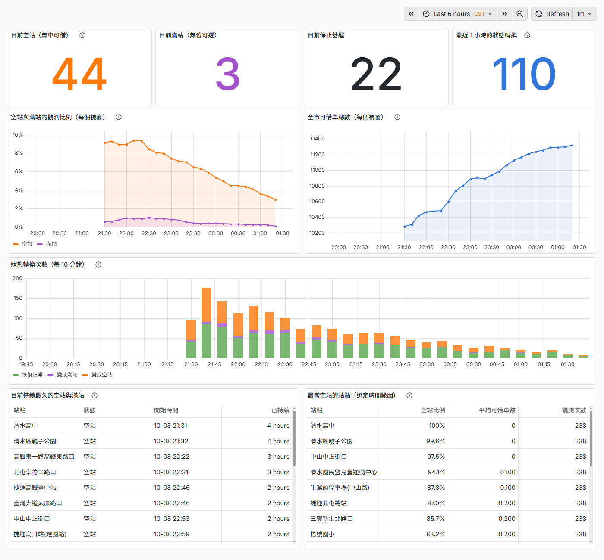
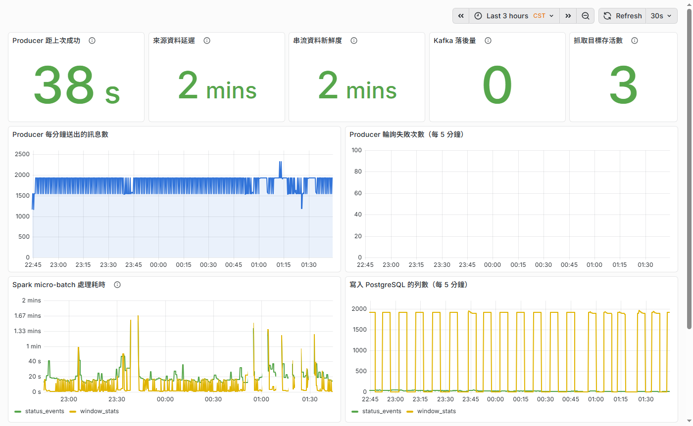
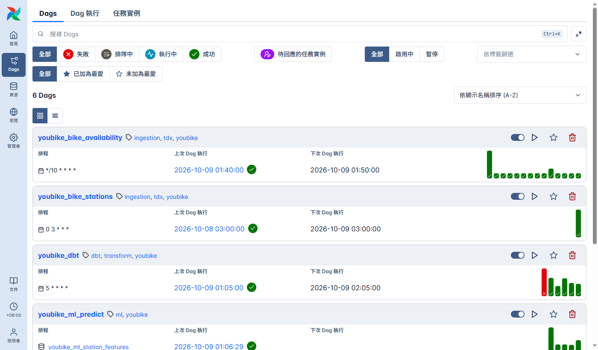

# 設計取捨

這個平台需要同時處理三件事：保存可追溯的歷史資料、掌握站點狀態，以及把資料轉成借還車建議。以下從五個實際問題說明採用的做法、選擇理由與限制。

## 資料規模與評估紀錄

| 指標 | 數值 | 如何理解 |
|---|---|---|
| 站點數 | 1,838 站 | 此次紀錄的台中 YouBike 2.0 站點數 |
| 每日車況擷取量（估算） | 264,672 列 | 假設每次取得 1,838 站、每 10 分鐘成功擷取一次，一天共 144 次；不是實測入庫量 |
| 站點狀態事件的延遲 | 中位數 104 秒，95% 的樣本不超過 152 秒 | 從來源更新車況到事件寫入資料庫的時間 |
| 每 10 分鐘統計的延遲 | 該時段結束後平均 12.7 分鐘 | 統計會等待較晚抵達的資料，其中設定的等待範圍為 10 分鐘 |
| 預測誤差（訓練評估） | 模型 2.82 台，基準 1.47 台 | 使用時間上最後 20% 的資料驗證，計算平均絕對誤差；數字越小越好 |
| 預測誤差（發布後追蹤） | 模型 4.96 台，基準 2.93 台 | 1,400 筆預測到期後與實際車數比對，計算平均絕對誤差 |

更新日期：2026-10-09

表中的基準是「一小時後的車數等於現在」。例如預測 8 台、實際 5 台，這筆預測的絕對誤差就是 3 台。量測與評估數值代表既有樣本，不代表所有時段的表現。

## 1. 清洗程式寫錯時，歷史資料能救回來嗎？

**遇到的問題**

資料來源只提供目前車況。如果只留下整理過的結果，之後才發現欄位處理錯誤，就可能無法還原當時的資料。來源沒有更新時，連續擷取也可能取得相同車況，分析前需要去除重複。

**採用的做法與理由**

先保存 API 的原始回應，再產生分析用的資料。原始資料保留每次擷取的結果，重複資料留到分析階段處理。這樣修改清洗或去重規則時，可以重新處理已保存的資料，也能追查某筆結果是如何產生的。

直接把整理後的資料寫入資料庫，步驟較少；保留原始回應則多了一條還原與查核的途徑，適合這個無法向來源重新取得歷史車況的專案。

**代價與限制**

需要額外的儲存空間與上傳步驟。原始資料含重複紀錄，不能直接拿筆數當成車況變化次數；沒有成功擷取的時段，也無法靠保存原檔補回。

**技術實作**：原始 JSON 與清洗後的檔案存入 Cloud Storage，載入 BigQuery 的原始資料表時只新增紀錄。dbt 以「站點識別碼＋來源更新時間」去重，再建立分析資料表。

## 2. 資料越來越多，如何控制處理成本？

**遇到的問題**

每小時重新整理全部歷史資料，會反覆處理已完成的內容，資料量越大，查詢成本越高。但只處理全新的紀錄，也需要考慮資料延遲與任務重試。

**採用的做法與理由**

每次從分析表最後記錄的擷取時間往前回看 3 小時，再處理這段範圍之後的原始資料。寫入時比對唯一識別資訊，已存在的紀錄更新，尚未存在的紀錄新增。

這種增量更新減少平常需要處理的資料量，同時保留重算近期資料的空間。若轉換任務失敗，但原始資料仍持續保存，下一輪可以從分析表先前的進度繼續處理。

**代價與限制**

每一輪仍會重算部分舊資料。3 小時是回看範圍，並不是「停機超過 3 小時就無法恢復」的期限。另外，合併寫入只比對目標表最近 2 天的分區；較舊資料的回補或修正，需要另外安排重算方式。

**技術實作**：dbt 增量模型搭配 `MERGE`。BigQuery 資料依日期分區、依站點集中儲存，讓查詢能縮小讀取範圍。

## 3. 即時狀態與歷史分析，為什麼分開處理？

**遇到的問題**

「現在有哪些站沒車？」需要頻繁更新；「哪些站在特定時段容易空站？」則需要累積歷史，也要能修改分析規則後重新計算。兩者對更新頻率與保存方式的需求不同。

**採用的做法與理由**

批次流程每 10 分鐘擷取車況，保存歷史並建立分析資料；串流流程每 60 秒查詢車況，持續處理站點狀態變化。兩條流程共用擷取與清洗程式，避免來源欄位出現兩套定義。

如果全部依靠串流，修改歷史分析時需要重新播放過去的訊息，而目前 Kafka 只保留 24 小時。分開處理，讓歷史重算與分鐘級狀態更新各自有合適的資料來源。

統計時也採用車況本身的更新時間。例如 10:05 的車況因系統延遲到 10:12 才收到，仍應歸入 10:00～10:10 的時段。系統會等待一定範圍的晚到資料，再完成該時段的統計。

**代價與限制**

需要維護兩條流程，API 查詢次數也會增加。即時狀態事件與每 10 分鐘統計的延遲不同：後者需要等待資料，不能當作即時車況。超出串流接納範圍的舊資料可能被略過，批次與串流的統計目前也沒有自動核對。

**技術實作**：Airflow、BigQuery 與 dbt 負責批次；Kafka、Spark 與 PostgreSQL 負責串流。Spark 使用事件時間切分 10 分鐘視窗，搭配 10 分鐘的 watermark 管理晚到資料；實際輸出時間還取決於事件進度。

## 4. 系統重啟或資料重送，如何避免重複紀錄？

**遇到的問題**

訊息寫入後，如果確認結果沒有成功傳回，系統可能再次送出同一筆資料。另一方面，一個站點持續沒車一小時，也不需要每分鐘都記錄一次「沒車」，才能知道空站持續多久。

**採用的做法與理由**

允許資料重送，但用唯一識別資訊辨認同一筆資料，避免重複寫入。站點狀態則保存目前狀況，只在正常、空站、滿站或停止營運之間發生變化時產生事件。

例如一個站點從有車變成沒車，再恢復有車，通常只需要記錄這兩次轉換，就能計算這段空站持續的時間。判斷邏輯獨立於 Spark，測試時可以直接驗證狀態變化。

這比要求訊息佇列、串流程式與外部資料庫共同協調交易更容易維護，適合目前能用站點與時間辨認紀錄的資料。

**代價與限制**

重複訊息仍會經過系統，唯一識別資訊必須選對。這個做法針對目前的資料表防止重複，不代表所有環節都有「只處理一次」的保證。系統第一次觀察到空站時，也無法得知它在啟動前已經空了多久。

**技術實作**：Spark 去除重複車況並保存站點狀態；PostgreSQL 以主鍵和 `ON CONFLICT` 處理重複寫入。這種可以安全重複執行的寫入方式稱為「冪等」。狀態保存在 checkpoint，修改狀態格式時須考慮既有狀態的相容性。

## 5. 預測與網頁服務，如何兼顧效果和維護成本？

### 預測：先建立可比較、可追蹤的評估方式

**遇到的問題**

使用模型產生預測，不等於預測就有幫助。必須有一致的比較方式，並在預測時間到期後確認實際結果。

**採用的做法與理由**

使用 BigQuery ML 的線性迴歸，預測熱門站點一小時後的可借車數。資料已在 BigQuery，可以直接訓練與預測，減少另外搬移資料、架設模型服務的工作。

評估時，同時比較「車數維持不變」的簡單估計，讓誤差有可理解的參考。依時間先後切分訓練與驗證資料，較接近用過去預測未來的使用情境；發布後也保存預測，等到期再與實際車數比對。

訓練與預測共用同一張特徵表，也就是把目前車數、近期變化、時段與星期整理成相同的輸入欄位，減少兩邊計算方式不一致的問題。

**代價與限制**

線性迴歸對複雜變化的表達能力有限，預測值也需要限制在 0 與總車位數之間。評估數值會受資料期間與站點組成影響，因此需要持續追蹤；目前的預測範圍也只涵蓋熱門站點。

**技術實作**：dbt 建立特徵表，BigQuery ML 每天訓練；特徵更新完成後由 Airflow 觸發預測。驗證使用時間上最後 20% 的資料，記錄平均絕對誤差與其他評估指標。

### 網頁：用定期更新的資料快照降低維護負擔

**遇到的問題**

網頁需要站點位置、車況與預測，但不適合持有資料庫憑證。為此架設查詢 API，還會增加服務監控與維護工作。

**採用的做法與理由**

由資料平台整理網頁需要的欄位，定期發布成一份 JSON 資料快照。瀏覽器下載後直接計算借還車建議，不需要透過自己的 API 伺服器查詢資料庫。

目前約 1,800 個站點的資料只有數百 KB，適合一次下載。資料平台暫停更新時，網頁仍可顯示最後一份快照，並提示資料已過期。

**代價與限制**

正常排程約每 10 分鐘更新，更新失敗時資料可能更舊；網頁仍可開啟，不代表車況仍然即時。每位使用者都要下載整份資料，規模大幅增加時需要重新評估。道路路線與地點搜尋仍依賴外部服務，無法取得道路路線時改用估算並標示。

**技術實作**：Airflow 匯出公開快照，靜態網頁使用 JavaScript、Leaflet 與外部地圖服務。資料庫與來源 API 的憑證留在資料平台，不放進網頁。

## 運作畫面

以下三張畫面呈現平台如何觀察車況、確認資料持續更新，以及追蹤各項任務的執行結果。

### 即時車況儀表板

查看目前的空站與滿站、全市可借車數的變化，以及空站持續最久的站點，讓串流產生的統計與狀態事件可以直接被閱讀。

### 系統運作儀表板

追蹤資料更新、處理量與耗時，協助分辨是來源資料沒有更新，還是擷取或串流處理出現異常。

### 資料流程排程

擷取、資料整理、預測與網頁快照更新由 Airflow 排程，並記錄每次任務的成功或失敗；發生問題時，可以找到需要檢查的環節。

