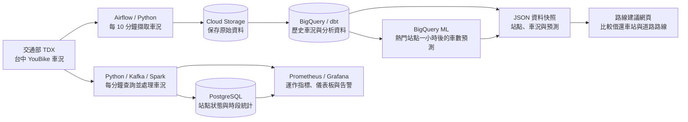
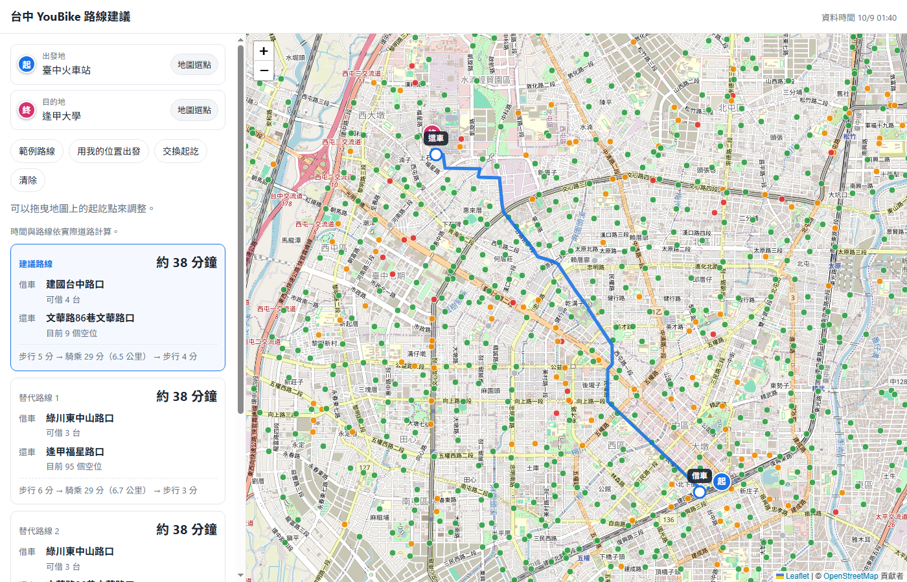

# 台中 YouBike 2.0 資料平台

到站才發現沒車可借，或騎到目的地卻沒有空位，是使用 YouBike 常遇到的問題。這個專案整合交通部 TDX 的台中 YouBike 車況資料，提供站點查詢與借還車路線建議，並透過歷史分析、車況預測與監控，追蹤資料和系統的運作狀況。

**[體驗路線建議網頁](https://yantingchen.github.io/youbike-data-platform/)**，按「範例路線」即可查看建議。

## 主要功能

- **借還車建議**：選擇出發地與目的地，比較附近站點的車輛、空位與交通時間，顯示步行與騎乘路線。
- **歷史分析**：保存車況紀錄與站點變更，觀察不同時段哪些站點容易沒車或沒空位。
- **車況預測**：預測熱門站點一小時後的可借車數，並與「車數維持不變」的簡單估計比較誤差。
- **運作監控**：追蹤站點狀態、資料更新、處理延遲與任務失敗，透過儀表板與告警協助找出異常。

## 整體架構

車況分成兩條流程：批次保存歷史，供分析與預測使用；串流持續追蹤站點狀態。網頁讀取定期更新的資料快照，儀表板呈現車況與系統運作指標。



## 路線建議畫面

輸入地點或直接在地圖上選擇起訖點，即可比較借還車方案；資料過期或路線仍為估算時，畫面會提示。



## 設計決策

為什麼保留原始資料、分開處理即時與歷史車況，以及如何控制成本、避免重複紀錄？[DESIGN.md：設計取捨與運作畫面](DESIGN.md) 說明這些選擇的理由與限制，並展示車況監控、系統監控與排程畫面。

## 技術選用

| 技術 | 在專案中的用途 |
|---|---|
| Python、pandas | 取得 API 資料，整理欄位、型態與時間 |
| Airflow | 排程擷取、分析、預測與網頁資料更新 |
| Google Cloud Storage、BigQuery | 保存原始資料，儲存並查詢歷史車況 |
| dbt | 建立分析資料表、保留站點歷史版本與檢查資料品質 |
| Kafka、Spark Structured Streaming、PostgreSQL | 持續處理車況訊息，記錄空站、滿站與狀態變化 |
| BigQuery ML | 訓練車況預測模型，記錄並評估預測誤差 |
| Prometheus、Grafana | 收集運作指標，呈現儀表板與異常告警 |
| JavaScript、Leaflet、OpenStreetMap／OSRM | 顯示地圖、查詢地點與計算道路路線 |
| Docker Compose、Ansible、Caddy | 建立執行環境、自動化部署與提供 HTTPS |
| pytest、Ruff、Node.js test runner、GitHub Actions | 測試、程式碼檢查與自動化流程 |

## 快速開始

在專案根目錄執行，需先安裝 Docker 與 Docker Compose。批次流程需要 TDX 憑證、GCP 專案、GCS bucket 與 BigQuery 原始資料集；雲端資源位置需與 `BQ_LOCATION` 一致。

1. 複製環境設定：

   ```sh
   cp .env.example .env
   ```

2. 在 `.env` 填入 `TDX_CLIENT_ID`、`TDX_CLIENT_SECRET`、`GCP_PROJECT_ID`、`GCS_BUCKET`，並確認資料集名稱與位置。為 `POSTGRES_PASSWORD`、`AIRFLOW_JWT_SECRET`、`GRAFANA_ADMIN_PASSWORD`、`GRAFANA_DB_PASSWORD` 設定各自的隨機英數字串。將自己的 GCP Service Account JSON 放在 `secrets/gcp-sa.json`，該帳號需能寫入 bucket、建立與讀寫 BigQuery 資料集，以及執行查詢。

3. 啟動全部服務（批次、串流與監控）：

   ```sh
   docker compose --profile streaming --profile monitoring up -d --build
   ```

開啟 [Airflow](http://localhost:8080)，啟用全部 `youbike_` 開頭的 DAG，共 6 個，涵蓋站點擷取、車況擷取、dbt、模型訓練、模型預測與網頁快照。

首次先手動執行 `youbike_bike_stations` 與 `youbike_bike_availability`，兩者成功後再執行 `youbike_dbt`；累積足夠訓練資料後，依序執行 `youbike_ml_train`、`youbike_ml_predict`。後續預測由 dbt 更新完成觸發，網頁快照由車況載入完成觸發。

發布快照需在 `.env` 設定 `SNAPSHOT_GCS_URI`，並讓該 GCS 物件可公開讀取；未設定時，`youbike_snapshot` 會略過。首次 dbt 完成後可手動執行快照任務。啟用監控後，可在 [Grafana](http://localhost:3000) 查看儀表板。

以上指令啟動資料平台服務；路線建議網頁可直接從頁首連結體驗。

## 授權

本專案以 [MIT License](LICENSE) 授權。第三方函式庫 Leaflet 使用 BSD 2-Clause 授權。
